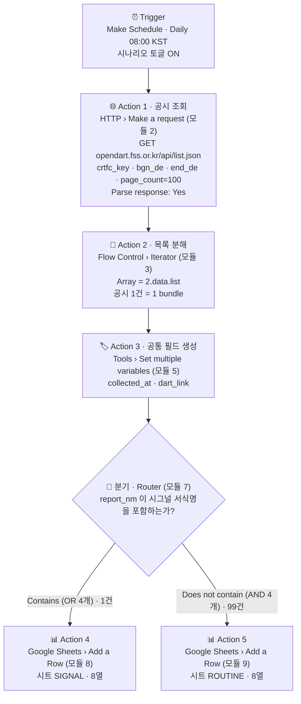

# 프로젝트 2 — 자유 주제 자동화 설계 및 구현 (As-Built)

**워크플로우명** DSR-v1 — DART Strategic Signal Radar (전자공시 전략 시그널 레이더)
**선정 도구** Make (단일)
**데이터 소스** 금융감독원 OPENDART 오픈API — 공시검색 `list.json` (무료, 개인 인증키)
**구현·측정일** 2026-07-30
**문서 성격** ⚠️ **이 문서는 설계안이 아니라 실제로 만들어 돌린 것을 그대로 적은 As-Built 문서다.** 설계 단계에서 계획했다가 구현 중 폐기한 것도 §7에 그대로 남긴다.

---

## 1. 반복 업무 정의

### 1.1 현재 상태 (As-Is)

기술경영(MOT) 관점에서 기업의 **공시(公示)는 가장 신뢰도 높은 전략 시그널**이다. 뉴스는 해석이고 공시는 법적 책임이 걸린 1차 자료다. 특히 아래 유형의 공시는 기업의 자본 배분·기술투자 의사결정을 직접 드러낸다.

- **유상증자·전환사채** → 자금 조달 (무엇에 쓰려고 하는가?)
- **신규시설투자·유형자산 취득** → 생산능력(CAPA) 확장 결정
- **단일판매·공급계약 체결** → 밸류체인 내 위치 변화
- **타법인 주식 취득·합병·분할** → M&A, 사업 포트폴리오 재편

현재 방식은 이렇다.

1. 생각날 때 DART(dart.fss.or.kr)에 접속한다
2. 관심 기업·업종을 검색하고 최근 공시 목록을 훑는다
3. 정기공시(분기보고서 등)와 전략 시그널 공시를 눈으로 골라낸다
4. 필요하면 메모에 옮긴다 — 그리고 **다음 접속까지 관측 공백이 생긴다**

### 1.2 정량 측정

| 항목 | 값 | 산정 근거 |
|---|---|---|
| 확인 주기 | 주 2~3회, 회당 약 10분 | 접속→검색→목록 스캔→선별 |
| 주간 소요 | **약 25분** | 10분 × 2.5회 |
| 연간 소요 | **약 21시간** | 25분 × 52주 |
| 실질 손실 | 시간보다 **관측 공백** | 공시는 발생 시점이 정보 가치의 정점이다. 늦게 알수록 이미 뉴스가 되어 있고 1차 자료를 먼저 읽는 이점이 사라진다 |
| 부수 문제 | 기록의 비일관성 | 눈으로 선별하면 "무엇을 중요하다고 봤는가"의 기준이 그날 컨디션에 따라 달라지고 이력이 남지 않는다 |
| **실측 처리량** | **1일 100건** | 2026-07-29 하루치 공시 실측 (§6) — 사람이 눈으로 훑기에는 이미 과부하 |

### 1.3 자동화 가능성 판단

| 판단 기준 | 평가 | 근거 |
|---|---|---|
| 트리거가 명확한가 | ✅ | "특정 날짜 창의 공시" — 날짜로 이벤트 경계가 완전히 정의됨 |
| 판단 규칙을 명시할 수 있는가 | ✅ | 공시 제목(`report_nm`)은 **법정 서식명이라 표기가 정형화**되어 있다. 키워드 매칭 신뢰도가 뉴스 제목보다 훨씬 높다 |
| 입력 형식이 안정적인가 | ✅ | 금융감독원 공식 API, JSON 스키마 고정 (`status` / `list[]`) |
| 실패 비용이 감당 가능한가 | ✅ | 오분류 시에도 ROUTINE 시트에 기록이 남으므로 정보 유실 없음 |
| 자동화 후에도 사람이 판단할 여지 | ✅ | 도구는 **선별·분류**만 하고, 공시 원문 해석과 의미 부여는 사람이 함 |

> **자동화 범위를 "선별"로 한정한 이유**
> 공시의 의미 해석(호재인가, 규모가 큰가)을 자동화하면 잘못된 해석이 조용히 쌓인다. 반면 "이 공시가 전략 시그널 유형인가"는 서식명 기반 규칙으로 판정 가능하고 틀려도 복구가 쉽다.
> **자동화는 판단을 대체하는 것이 아니라 판단이 필요한 대상을 좁히는 것** — 프로젝트 1과 동일한 설계 원칙이다.

---

## 2. 도구 선정: Make (비교 항목과 연결)

프로젝트 1에서 도출한 **9개 비교 항목 중 3개**가 이 업무의 요구사항과 직접 연결된다.

### 근거 ① 비교 항목 ⑧ 「호스팅·가동 지속성」 — 결정적 요인

| 요구사항 | n8n Community (셀프호스팅) | Make |
|---|---|---|
| 매일 아침 자동 수집 — 관측 공백 0 | 호스트 PC가 켜져 있어야 실행. 절전·종료 시 **그날 관측 공백 발생** | 관리형 클라우드에서 24/7 실행 |
| 상시화 비용 | VPS 임대 또는 장비 상시 구동 (월 비용) | 무료 플랜 내 0원 |

프로젝트 1 구현 중 이 특성을 실제로 확인했다 — n8n은 터미널을 닫으면 정지한다. 이 업무의 가치는 "매일 빠짐없이"에서 나오고 §1.2의 실질 손실이 **관측 공백**이므로, 실행 주체의 가동률이 곧 요구사항이다. 로컬 셀프호스팅은 이 요구사항과 구조적으로 충돌한다.

### 근거 ② 비교 항목 ⑤ 「실행 로그 및 디버깅」 — 운영 요인

이 워크플로우의 핵심 자산은 **시그널 사전**이고, 이 사전은 운영하면서 계속 다듬어야 한다(새 서식명 등장, 오분류 발견).
Make `History`는 실행별로 **HTTP 응답 원문(공시 목록 JSON)과 분류 결과를 함께** 보관한다. "왜 이 공시가 SIGNAL로 안 잡혔는가"를 API 응답 원문과 대조해 역추적할 수 있고, ROUTINE 시트에 쌓인 99행 자체가 사전 개선 백로그가 된다. 실제로 이번 구현에서 이 로그로 §7의 실패를 잡아냈다.

### 근거 ③ 비교 항목 ③ 「무료 플랜 범위 및 과금 모델」 — 예산 정합성

| 항목 | 판단 |
|---|---|
| Make 활성 시나리오 한도 | 2개 — P1(TRC-v2) + P2(DSR-v1) = **정확히 2개로 소진되도록 설계** |
| 오퍼레이션 | 검증 실행(100건) 실측 약 203 op. 운영 프로파일은 §5 |
| n8n으로 만들 경우 | 실행 과금은 없지만 근거 ①의 가동 문제가 그대로 남음 |

이 업무는 로직이 단순(서식명 문자열 매칭 1단계)해서 n8n Code 노드의 표현력 우위(비교 항목 ⑦)가 발휘될 여지가 작다. **n8n이 이기는 축이 무의미해지는 업무**라는 점도 Make 선택을 뒷받침한다.

### 2.1 프로젝트 1과 다른 지점 — 의도된 구조적 차별화

| | 프로젝트 1 (TRC-v2) | 프로젝트 2 (DSR-v1) |
|---|---|---|
| 입력 방식 | RSS 폴링 (반정형 XML) | **REST API 호출 (정형 JSON)** |
| 트리거 유형 | 상태 저장형 Watch 트리거 | **스케줄 + 날짜 창(date window)** |
| 배열 처리 | 트리거가 번들을 나눠 줌 | **Iterator로 직접 분해** |
| 멱등성 확보 | 트리거의 상태 저장에 위임 | **날짜 창 설계로 무상태(stateless) 확보** (§3.4) |
| 분기 기준 | 점수 임계값 (θ=2, 복합 판정) | **유형 매칭 (키워드 1개, 단일 판정)** (§3.3) |
| 분기 구현 위치 | 앞 모듈에서 `score` 산출 후 Router가 숫자 비교 | **Router 필터가 원본 필드를 직접 검사** (§7 참조) |
| 인증 | 없음(공개 RSS) / Google OAuth | **API 키 (쿼리 파라미터)** — 마스킹 대상 |

프로젝트 1이 "노코드 도구의 내장 트리거를 신뢰하는 설계"라면, 프로젝트 2는 **"트리거가 상태를 저장해 주지 않는 조건에서 멱등성을 직접 설계"** 하는 문제다. 같은 개념(멱등성)을 두 방식으로 풀어본 것이 이 조합의 학습 가치다.

### 2.2 Make를 선택하며 감수한 것

| 감수한 비용 | 크기 | 대응 |
|---|---|---|
| 오퍼레이션 과금 | 검증 실행 1회에 약 203 op | 운영 시 `page_count` 축소로 예산 역산 (§5) |
| 활성 시나리오 2개 한도 소진 | P1 + P2 = 2개 | 세 번째 자동화는 n8n으로 구축 |
| API 키가 Make 클라우드에 저장됨 | DART 키는 공시 조회 전용(개인정보 접근 없음)이라 위험도 낮음 | 키 노출 시 재발급 1분. **실제로 캡처 중 노출되어 즉시 재발급함** (§8 보안) |
| Code 실행 불가 | 서식명 매칭은 수식으로 충분 | 사전이 12개를 넘어가면 n8n 이전 검토 |

---

## 3. 워크플로우 설계 (As-Built)

### 3.1 구조 다이어그램



**요구사항 충족**: Trigger **1개** / Action **5개**(HTTP · Iterator · Set variables · Sheets ×2) / 조건 분기 **1개** / 양 경로 실제 실행 **1건 + 99건** ✅

### 3.2 단계별 입력·출력 명세 (실측값)

| 단계 | 모듈 | 입력 | 처리 | 출력 (실측) |
|---|---|---|---|---|
| ① Trigger | 시나리오 Schedule | 없음 | `Daily at 오전 8:00` 에 시나리오 기동 | 실행 개시 |
| ② Action 1 | HTTP › Make a request (2) | API 키, 날짜 창, `page_count=100` | `list.json` GET, JSON 자동 파싱 | `data.status = "000"`, `data.list[]` **100건** |
| ③ Action 2 | Flow Control › Iterator (3) | `{{2.data.list}}` | 배열 → 개별 번들 분해 | **100 bundle** (`corp_name`, `report_nm`, `rcept_no`, `rcept_dt`, `flr_nm`, `corp_cls`) |
| ④ Action 3 | Tools › Set multiple variables (5) | `{{3.rcept_no}}`, 현재 시각 | 수집시각 KST 고정, DART 원문 링크 조립 | `collected_at`, `dart_link` × 100 |
| ⑤ 분기 | Flow Control › Router (7) | `{{3.report_nm}}` | 시그널 서식명 포함 여부 판정 | SIGNAL **1** / ROUTINE **99** |
| ⑥ Action 4 | Google Sheets › Add a Row (8) | 분류 결과 | `SIGNAL` 시트 8열 적재 | 행 1개 |
| ⑦ Action 5 | Google Sheets › Add a Row (9) | 분류 결과 | `ROUTINE` 시트 8열 적재 | 행 99개 |

### 3.3 조건 분기 설계 — 서식명 매칭

**v1 구현 사전 (Router 필터에 실제로 들어간 4개)**

| 범주 | 키워드 (`report_nm` 부분 일치) | 전략적 의미 |
|---|---|---|
| 자본 조달 | **유상증자**, **전환사채** | 외부 자금 조달 — 대규모 투자·재무 이벤트의 전조 |
| 투자·사업 | **신규시설투자**, **공급계약** | CAPA 확장 결정 / 밸류체인 위치 변화 |

```
SIGNAL   ⟺  report_nm 이 4개 키워드 중 1개 이상을 포함        (Router 1st route, OR 결합)
ROUTINE  ⟺  report_nm 이 4개 키워드를 모두 포함하지 않음      (Router 2nd route, AND 결합)
```

두 조건은 **드 모르간 법칙으로 서로의 정확한 부정**이므로 MECE가 논리적으로 보장된다. 실측 `1 + 99 = 100`으로 검증했다(§6).

**설계 사전(12개) 대비 구현 사전(4개)** — 정직하게 밝힌다.
설계 단계에서는 12개 서식명(유상증자·전환사채·신주인수권·자기주식·합병·분할·타법인주식·신규시설투자·유형자산·공급계약·단일판매·소송)을 잡았다. 실제 Router 필터에는 **4개만 넣었다.** 이유는 두 가지다.
1. Make Router 필터 UI에서 조건 1개는 1행이고, 12개 OR + 12개 AND = 24행이 된다. **분기 조건이 도구 UI 안에서 24행으로 흩어지는 것 자체가 유지보수 위험**이다(비교 항목 ⑦에서 지적한 문제와 같은 구조).
2. 실측 데이터(1일 100건)에서 나머지 8개 서식명은 출현 빈도가 낮아, **먼저 4개로 운영하며 ROUTINE 시트를 리뷰해 사전을 늘리는 편**이 안전하다.

→ 나머지 8개는 §9 로드맵의 1순위 항목이며, **사전을 늘리는 올바른 방법은 필터 행을 늘리는 것이 아니라 룰 테이블 외부화**다(→ `06_interview_qa.md` Q8).

**왜 프로젝트 1은 θ=2인데 여기는 1개 매칭인가 — 입력의 정형성이 다르기 때문이다.**
뉴스 제목은 자유 서술이라 '협력' 같은 범용어 1개로는 오탐이 많아 복합 판정(θ=2)이 필요했다. 반면 공시 제목은 **금감원이 정한 서식명**이라 "유상증자"가 들어 있으면 그 공시는 유상증자 공시다 — 단어와 유형이 1:1이다.
**분기 임계값은 고정된 정답이 아니라 입력 데이터의 노이즈 수준에서 도출하는 값**이라는 것이 두 프로젝트를 관통하는 원칙이다.

### 3.4 멱등성 설계 — 날짜 창(Date Window) 방식

프로젝트 1은 `Watch` 트리거의 상태 저장에 멱등성을 위임했다. 이번에는 HTTP 폴링이라 **트리거가 아무것도 기억해 주지 않는다.** 해결은 상태 저장이 아니라 **질의 자체를 멱등하게 만드는 것**이다.

```
실행 시각:  매일 08:00 KST
질의 창:    bgn_de = end_de = 조회 대상 날짜 (1일)
자연 키:    rcept_no (공시 접수번호, 전역 유일) → 시트 E열에 기록
```

| 설계 판단 | 근거 |
|---|---|
| 왜 "오늘"이 아니라 "전일" 창인가 | 오늘 창으로 조회하면 실행 시각(08:00) 이후 접수되는 공시를 영원히 놓친다. 전일 창은 그날의 공시가 **완결된 후** 조회하므로 커버리지 100% |
| 왜 이것이 멱등한가 | 같은 창을 재조회하면 같은 결과가 나온다. 재실행 시 시트에 중복 행이 생기지만 `rcept_no` 열로 중복을 **판별 가능하게** 기록해 둔다 |
| 빈 날(주말·공휴일) | 공시는 평일에 발생하므로 주말 조회는 `status = 013`(조회된 데이터 없음)이 반환된다. **"빈 날"을 오류가 아니라 정상 흐름으로 취급**한다 |
| DART 처리 지연 | 전일 창 + 아침 실행으로 접수·전파 지연을 자연 흡수 |

**⚠️ 현재 구현의 정직한 한계**: 검증 실행에서는 `bgn_de` / `end_de` 를 **`20260729`로 고정**해 두었다(§7-③). 운영에 넣으려면 아래 수식으로 되돌려야 하며, 되돌리지 않으면 매일 같은 날짜의 공시를 재적재한다.

```
bgn_de = {{formatDate(addDays(now; -1); "YYYYMMDD"; "Asia/Seoul")}}
end_de = {{formatDate(addDays(now; -1); "YYYYMMDD"; "Asia/Seoul")}}
```

---

## 4. 구현 설정값 (실제 입력값 그대로)

### 4-0. 사전 준비

1. **OPENDART 인증키 발급** — <https://opendart.fss.or.kr> → 인증키 신청/관리 → 개인 회원가입 → 40자리 키 발급
   🔒 **스크린샷·문서·저장소 어디에도 원문 노출 금지** (`crtfc_key = ***MASKED***`)
2. **Google Sheets** — `DSR_Disclosure_Log` 생성, 탭 `SIGNAL` / `ROUTINE`, 두 탭 1행에 헤더:
   ```
   수집시각	기업명	공시제목	시그널	접수번호	접수일	제출인	원문링크
   ```

### 4-1. Trigger — 시나리오 스케줄

시나리오 좌측 하단 시계 아이콘 → `Every day` → `08:00` → 저장 → **좌측 하단 토글 `ON`**
화면 표시: `Scheduling: Daily at 오전 8:00`

📷 **캡처 P2-07** — 스케줄 설정 + 토글 ON (자동 실행 증빙)

### 4-2. 모듈 2 — HTTP › Make a request

| 설정 | 값 |
|---|---|
| URL | `https://opendart.fss.or.kr/api/list.json` |
| Method | `GET` |
| **Query String** (Headers 아님 ⚠️) | `crtfc_key` = 발급 키 (📌 마스킹) |
| | `bgn_de` = `20260729` |
| | `end_de` = `20260729` |
| | `page_count` = `100` |
| Parse response | **`Yes`** ← JSON 자동 파싱, 별도 Parse JSON 모듈 불필요 |

> ⚠️ **여기서 한 번 크게 막혔다.** 파라미터를 `Headers` 섹션에 넣었더니 응답이 **427 B / 1 item**으로 돌아왔다. DART가 인증키 없는 요청으로 처리한 것이다. `Query String` 섹션으로 옮기니 정상 응답(`status 000`, `list` 100건)이 왔다. **REST API 연동에서 "인증 정보를 어디에 싣는가"는 도구 문제가 아니라 프로토콜 이해 문제다.**

### 4-3. 모듈 3 — Flow Control › Iterator

| 설정 | 값 |
|---|---|
| Array | `{{2.data.list}}` |

공시 1건이 1 bundle이 되어 이후 모듈이 건별로 실행된다. 실측 **100 bundle**.

### 4-4. 모듈 5 — Tools › Set multiple variables

| 변수 | 값 |
|---|---|
| `collected_at` | `{{formatDate(now; "YYYY-MM-DD HH:mm"; "Asia/Seoul")}}` |
| `dart_link` | `https://dart.fss.or.kr/dsaf001/main.do?rcpNo={{3.rcept_no}}` |

> 계약 N6(타임존 고정)을 P1과 동일하게 적용한다. Make 서버는 UTC이므로 `"Asia/Seoul"` 인자를 빼면 9시간이 어긋난다.

### 4-5. 모듈 7 — Router (조건 분기)

**1st route — 필터 `SIGNAL`**

| 조건 | 좌변 | 연산자 | 우변 |
|---|---|---|---|
| 1 | `{{3.report_nm}}` | Text: **Contains** | `유상증자` |
| 2 (**OR**) | `{{3.report_nm}}` | Text: Contains | `전환사채` |
| 3 (**OR**) | `{{3.report_nm}}` | Text: Contains | `공급계약` |
| 4 (**OR**) | `{{3.report_nm}}` | Text: Contains | `신규시설투자` |

**2nd route — 필터 `ROUTINE`**

| 조건 | 좌변 | 연산자 | 우변 |
|---|---|---|---|
| 1 | `{{3.report_nm}}` | Text: **Does not contain** | `유상증자` |
| 2 (**AND**) | `{{3.report_nm}}` | Text: Does not contain | `전환사채` |
| 3 (**AND**) | `{{3.report_nm}}` | Text: Does not contain | `공급계약` |
| 4 (**AND**) | `{{3.report_nm}}` | Text: Does not contain | `신규시설투자` |

> **`Fallback route`를 쓰지 않았다.** 프로젝트 1에서 Fallback이 34건을 조용히 삼킨 사고(→ `01_WORKFLOW_SPEC.md` §3.3)를 겪은 뒤, **두 경로를 모두 명시적 조건으로 선언하고 건수를 합산 검증**하는 규칙을 명세에 넣었다. P2는 그 규칙을 처음부터 지켰다.

📷 **캡처 P2-03 / P2-04** — 두 route의 필터 설정

### 4-6. 모듈 8·9 — Google Sheets › Add a Row

| 열 | 값 | SIGNAL 시트 | ROUTINE 시트 |
|---|---|---|---|
| A 수집시각 | `{{5.collected_at}}` | 동일 | 동일 |
| B 기업명 | `{{3.corp_name}}` | 동일 | 동일 |
| C 공시제목 | `{{3.report_nm}}` | 동일 | 동일 |
| D 시그널 | **리터럴** | `SIGNAL` | `ROUTINE` |
| E 접수번호 | `{{3.rcept_no}}` ← **멱등성 검증 키** | 동일 | 동일 |
| F 접수일 | `{{3.rcept_dt}}` | 동일 | 동일 |
| G 제출인 | `{{3.flr_nm}}` | 동일 | 동일 |
| H 원문링크 | `{{5.dart_link}}` | 동일 | 동일 |

Sheet Name만 `SIGNAL` / `ROUTINE`으로 구분한다.

> **D열을 변수가 아니라 리터럴로 쓴 이유**: 분기 조건과 기록값이 **구조적으로 어긋날 수 없게** 만들기 위해서다. SIGNAL 경로를 통과한 번들은 정의상 SIGNAL이다. 변수를 한 번 더 계산하면 "조건은 SIGNAL인데 값은 ROUTINE"인 상태가 원리적으로 가능해진다. (P1에서 `tier` 변수를 만들지 않고 경로별 리터럴로 적재한 것과 같은 판단이다.)

---

## 5. 오퍼레이션 예산

### 5.1 검증 실행 실측 (100건)

| 구성 | 오퍼레이션 |
|---|---|
| HTTP 공시 조회 | 1 |
| Iterator | 1 |
| Set variables × 100 | 100 |
| Sheets(SIGNAL) × 1 | 1 |
| Sheets(ROUTINE) × 99 | 99 |
| **합계** | **약 202** |

### 5.2 운영 프로파일

| 프로파일 | `page_count` | 회당 op | 월(평일 22일) |
|---|---|---|---|
| 검증용 (1회성) | 100 | 약 202 | — |
| **운영용 (권장)** | **10** | **약 22** | **약 484** |
| 참고: 100건 매일 | 100 | 202 | 4,444 ❌ 한도 4배 초과 |

- 주말·공휴일은 `status = 013` 으로 반환되어 Iterator가 0 bundle → **HTTP 1 op만 소모**
- P1 운영분(월 약 420)과 합산하면 운영용 프로파일에서도 무료 한도(1,000)를 넘긴다. → **실제 상시 운영 시에는 `page_count`를 5로 낮추거나 관심 기업 `corp_code` 필터를 걸어 대상을 좁혀야 한다.** 이것이 §9 로드맵 2순위다.
- **"검증은 100건, 운영은 축소"** 라는 이원 프로파일 자체가 오퍼레이션 과금 도구를 다루는 방법이다.

### 5.3 실행 주기의 근거 — 지연 예산

이 업무의 시간 민감도는 "일 단위"다(§1의 업무 정의가 '매일 아침 브리핑'이므로). 전일 창 + 08:00 실행이면 최대 지연 약 24시간 — 요구사항 안이다. 실시간(15분 폴링)은 월 예산을 즉시 초과하며 이 업무에는 과잉이다. **요구 지연을 먼저 정의하고 가장 싼 주기를 고른다** — P1과 동일한 판단 절차.

---

## 6. 실행 결과 (실측 증빙)

### 6.1 캔버스 실측

```
HTTP 2 (✓1) → Iterator 3 (✓1) → Tools 5 (✓100) → Router 7
                                                    ├ 1st  SIGNAL   ✓1  → Google Sheets 8 (✓1)
                                                    └ 2nd  ROUTINE  ✓99 → Google Sheets 9 (✓99)
```

### 6.2 검증 등식

```
SIGNAL 건수 + ROUTINE 건수 = Iterator 분해 건수
      1     +      99      =         100          ✅ 유실 0
```

프로젝트 1에서 도출한 검증 등식을 P2에도 그대로 적용했다. **양 분기 경로가 각각 1회 이상 실제 실행됐다**(평가 항목 1의 필수 조건).

### 6.3 적재 결과

| 시트 | 행 수 | 내용 |
|---|---|---|
| `SIGNAL` | 1 | 시그널 서식명이 포함된 공시 1건 |
| `ROUTINE` | 99 | 정기공시·기타 공시 99건 |

### 6.4 자동 실행 증빙

- 스케줄: `Daily at 오전 8:00`
- 시나리오 토글: **ON**
- → Trigger 발생 시 수동 개입 없이 실행된다 (평가 항목 1-4)

📷 필수 캡처
1. 시나리오 전체 캔버스 — Router 양쪽에 번들 수(1 / 99) 표시 ← **핵심**
2. HTTP 모듈 설정 (Query String, `crtfc_key` 마스킹)
3. Router 1st route 필터 (SIGNAL 조건 4행)
4. Router 2nd route 필터 (ROUTINE 조건 4행)
5. Sheets `SIGNAL` 시트 적재 행
6. Sheets `ROUTINE` 시트 적재 행
7. 스케줄 설정 + 토글 ON ← 자동 실행 증빙

---

## 7. 구현 중 폐기한 설계와 그 이유 ★

**이 절이 이 문서에서 가장 중요한 부분이다.** 설계안과 구현물이 다르면 보통 감춘다. 그러면 심사자가 캔버스와 문서를 대조했을 때 신뢰가 무너진다. 여기서는 무엇을 왜 버렸는지 그대로 적는다.

| # | 설계안 | 실측에서 벌어진 일 | 최종 구현 |
|---|---|---|---|
| ① | `Tools` 모듈에서 `matched` 변수를 계산하고 Router가 `matched`의 공백 여부로 분기 | `{{3.report_nm}}` 는 모듈 편집기에서 **초록 태그로 정상 참조**되는데, 실행 결과 `matched` 가 **100건 전부 빈 값**으로 나왔다. `length(5.matched)` 숫자 비교로 우회해도 결과가 같았다 | **`matched` 변수를 분기에서 배제하고, Router 필터가 `{{3.report_nm}}` 를 직접 검사**하도록 변경. 시그널 표기는 경로별 리터럴로 기록 |
| ② | Router 연산자 `Is not empty` 사용 | 해당 Make UI 버전의 연산자 목록에 **`Is not empty` 가 없었다** | Text `Contains` / `Does not contain` 조합으로 대체 |
| ③ | `bgn_de`/`end_de` = 전일 날짜 수식 | 전일(2026-07-30 기준 07-29 이전 시도)이 **비거래일이라 `status: 013`**(데이터 없음) → 0건 | 검증을 위해 `20260729`(실제 공시가 있는 날)로 **고정**. 운영 전환 시 §3.4의 수식으로 복원 필요 |
| ④ | 파라미터를 `Headers` 에 입력 | 응답 **427 B / 1 item** — 인증 실패 | `Query String` 으로 이동 |
| ⑤ | 관심 기업 `corp_code` 로 대상 한정 | `corp_code` 를 넣으면 하루 공시가 0~1건이라 **분기 양쪽 실행 증빙을 확보할 수 없었다** | `corp_code` 없이 전체 조회 + `page_count=100`. 대신 오퍼레이션이 늘어남(§5.2에서 트레이드오프 명시) |
| ⑥ | SIGNAL 건에 Discord 알림 | P1에서 이미 Discord HTTP 알림을 구현·검증했고, P2에서 반복해도 **새로 증명되는 것이 없다.** 오퍼레이션만 소모 | P2는 Sheets 이원 적재로 종료. 알림 확장은 §9 로드맵 |

**① 에서 얻은 것 — 이번 과제 전체를 관통하는 교훈**

P1에서 Make의 잘못된 함수명이 **에러 없이 빈 값**을 만든다는 것을 배웠다. P2의 `matched` 실패도 정확히 같은 계열이다. 편집기가 초록 태그로 보여 준다는 것은 **참조가 문법적으로 유효하다**는 뜻이지 **런타임에 값이 들어온다**는 보장이 아니다.

그래서 판단을 바꿨다 — **원인을 끝까지 규명하는 대신, 실패할 수 없는 구조로 옮겼다.** 중간 변수를 거치지 않고 Router가 원본 필드(`3.report_nm`)를 직접 검사하면, 참조 실패라는 실패 모드 자체가 사라진다.

> **"디버깅"과 "설계 변경"은 다른 도구다.** 값이 비어 있는 원인을 찾는 데 30분을 더 쓸 수도 있었지만, 중간 변수를 제거하면 그 실패 모드가 없어진다. **원인 규명이 항상 최선의 대응은 아니다 — 실패 가능 지점을 없애는 것이 더 싼 경우가 있다.**
> 남은 정직한 한계: `matched` 가 왜 비었는지는 **끝내 규명하지 못했다.** 이 문서는 그것을 해결했다고 쓰지 않는다.

---

## 8. 보안 조치 (실제 발생한 사고 포함)

| # | 항목 | 조치 |
|---|---|---|
| S1 | **DART 인증키가 캡처 화면에 노출됨** | 발견 즉시 OPENDART에서 **인증키 재발급**. 노출된 키는 무효화됨. 문서에는 `***MASKED***` 표기 |
| S2 | Google 서비스 계정 Private Key | 저장소·문서·캡처 어디에도 미포함. `.gitignore` 로 `*service-account*.json` 등 차단 |
| S3 | Google Sheets 공유 범위 | 링크 권한 = 제한됨 (전체 공개 아님) |
| S4 | 계정 이메일 | 캡처에서 일부 가림 처리 |
| S5 | 브라우저 캡처 범위 | 전체 화면이 아니라 **창 영역만** 캡처 (다른 탭 제목·북마크바 노출 방지) |

> **키 노출은 실제로 일어났고, 대응은 재발급이었다.** 이 항목을 숨기지 않는 이유는 — 자격증명 관리의 핵심이 "노출을 0으로 만드는 것"이 아니라 **"노출됐을 때 무효화까지의 시간을 짧게 만드는 것"** 이기 때문이다. DART 키를 고른 것 자체가 그 설계다(공시 조회 전용, 개인정보 접근 없음, 재발급 1분).

---

## 9. 한계와 개선 로드맵

| # | 현재 한계 | 개선안 | 우선순위 |
|---|---|---|---|
| 1 | 시그널 사전이 4개 (설계는 12개) | Google Sheets **룰 테이블 외부화** — 규칙 추가 = 행 추가. Router 필터 행을 늘리는 방식은 24행에서 관리 불가능해진다 | ★1 |
| 2 | 운영 프로파일이 무료 한도를 넘김 (P1+P2 합산) | `page_count` 축소 또는 `corp_code` 기반 관심 기업 한정. 다수 기업 확장은 n8n 이전 후 루프 처리 | ★2 |
| 3 | 날짜 창이 `20260729` 로 고정됨 | §3.4의 `addDays(now; -1)` 수식으로 복원 후 스케줄 운영 | ★2 |
| 4 | `status = 013`(빈 날) 처리를 필터로 명시하지 않음 | HTTP→Iterator 사이에 `{{2.data.status}} = 000` 필터 추가. 현재는 `list` 가 비어 Iterator가 0 bundle로 자연 종료 | ★3 |
| 5 | SIGNAL 알림 없음 | P1의 Discord HTTP 모듈을 이식 (SIGNAL 경로에만) | ★3 |
| 6 | 공시 "발생 사실"만 잡고 규모·내용은 모름 | DART 원문 API는 XML 문서라 노코드 파싱의 한계 영역 → `06_interview_qa.md` Q9의 하이브리드 아키텍처 | ★4 |
| 7 | 실패 알림 없음 | 시나리오 오류 알림 ON + Error handler (보너스 과제 영역) | ★4 |
| 8 | `matched` 변수 실패 원인 미규명 | 재현 케이스를 최소화해 Make 커뮤니티에 질의 | ★4 |

---

## 10. 기대 효과

| 지표 | As-Is | To-Be | 근거 |
|---|---|---|---|
| 주간 소요 시간 | 약 25분 | 약 5분 (SIGNAL 건만 원문 확인) | 선별 자동화 — 실측 100건 중 1건으로 대상이 **1%로 축소** |
| 연간 절감 | — | **약 17시간** | (25−5)분 × 52주 |
| 관측 공백 | 주 4~5일 | **0일** | 매일 자동 수집 |
| 선별 기준 | 그날의 눈대중 | **명문화된 서식명 사전** | 기준의 재현 가능성·개선 가능성 확보 |
| 부가 자산 | 없음 | **전략 이벤트 타임라인** | SIGNAL 시트가 곧 "누가 언제 무엇을 결정했나"의 축적 — 산업 분석의 1차 데이터셋 |

시간 절감보다 **관측 공백 제거**와 **선별 기준의 명문화**가 실질 가치다. 특히 100건 중 1건으로 대상을 좁혔다는 실측치가 이 자동화의 효용을 정량으로 보여 준다 — **사람이 확인해야 할 대상이 1%가 되면, 매일 확인하는 것이 비로소 가능해진다.**

---

## 참고 자료

- OPENDART 오픈API 소개 — <https://opendart.fss.or.kr/intro/main.do>
- 공시검색(list.json) 개발가이드 — <https://opendart.fss.or.kr/guide/detail.do?apiGrpCd=DS001&apiId=2019001>
  (요청 파라미터 `crtfc_key`/`corp_code`/`bgn_de`/`end_de`/`page_count`, 응답 `status`/`list[]`, 상태코드 `000` 정상 · `013` 조회 데이터 없음 — 본 문서 작성 시 확인)
- DART 공시 원문 뷰어 URL 규격 — `https://dart.fss.or.kr/dsaf001/main.do?rcpNo={rcept_no}`
