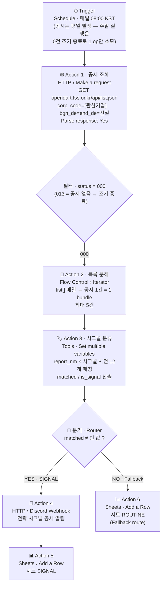

# 프로젝트 2 — 자유 주제 자동화 설계 및 구현

**워크플로우명** DSR-v1 — DART Strategic Signal Radar (관심 기업 공시 전략 시그널 레이더)
**선정 도구** Make (단일)
**데이터 소스** 금융감독원 OPENDART 오픈API (공시검색 `list.json`) — 무료, 개인 인증키
**작성일** 2026-07-26

---

## 1. 반복 업무 정의

### 1.1 현재 상태 (As-Is)

기술경영(MOT) 관점에서 기업의 **공시(公示)는 가장 신뢰도 높은 전략 시그널**이다. 뉴스는 해석이고 공시는 법적 책임이 걸린 1차 자료다. 특히 아래 유형의 공시는 기업의 자본 배분·기술투자 의사결정을 실시간으로 드러낸다.

- **유상증자·전환사채** → 자금 조달 (무엇에 쓰려고 하는가?)
- **타법인 주식 취득·합병·분할** → M&A, 사업 포트폴리오 재편
- **신규 시설투자·유형자산 취득** → 생산능력(CAPA) 확장 결정
- **단일판매·공급계약 체결** → 밸류체인 내 위치 변화

나는 취업 목표 기업(삼성전자 등 대기업)과 산업 분석을 위해 이런 공시를 추적하려 하지만, 현재 방식은 이렇다.

1. 생각날 때 DART(dart.fss.or.kr)에 접속한다
2. 관심 기업을 검색하고 최근 공시 목록을 훑는다
3. 정기공시(분기보고서 등)와 단순 공시 사이에서 전략 시그널 공시를 눈으로 골라낸다
4. 필요하면 수첩·메모에 옮긴다 — 그리고 **다음 접속까지 공백이 생긴다**

### 1.2 정량 측정

| 항목 | 값 | 산정 근거 |
|---|---|---|
| 확인 주기 | 주 2~3회, 회당 약 10분 | 접속→검색→목록 스캔→선별 |
| 주간 소요 | **약 25분** | 10분 × 2.5회 |
| 연간 소요 | **약 21시간** | 25분 × 52주 |
| 실질 손실 | 시간보다 **관측 공백** | 확인하지 않는 날의 공시는 놓친다. 공시는 발생 시점이 정보 가치의 정점이다 — 늦게 알수록 이미 뉴스가 되어 있고, 1차 자료를 먼저 읽는 이점이 사라진다 |
| 부수 문제 | 기록의 비일관성 | 눈으로 선별하면 "무엇을 중요하다고 봤는가"의 기준이 그날 기분에 따라 달라지고 이력이 남지 않는다 |

### 1.3 자동화 가능성 판단

| 판단 기준 | 평가 | 근거 |
|---|---|---|
| 트리거가 명확한가 | ✅ | "전일(前日) 신규 공시 발생" — 날짜 창(date window)으로 이벤트 경계가 완전히 정의됨 |
| 판단 규칙을 명시할 수 있는가 | ✅ | 공시 제목(`report_nm`)은 **법정 서식명이라 표기가 정형화**되어 있다 — "유상증자결정", "신규시설투자" 등. 키워드 매칭 신뢰도가 뉴스 제목보다 훨씬 높다 |
| 입력 형식이 안정적인가 | ✅ | 금융감독원 공식 API, JSON 스키마 고정 (`status`/`list[]`) — 이번 과제에서 가장 안정적인 입력원 |
| 실패 비용이 감당 가능한가 | ✅ | 오분류 시에도 시트에 기록은 남으므로 정보 유실 없음 |
| 자동화 후에도 사람이 판단할 여지 | ✅ | 도구는 **선별·분류**만 하고, 공시 원문 해석과 의미 부여는 사람이 함 |

> **자동화 범위를 "선별"로 한정한 이유**
> 공시의 의미 해석(호재인가, 규모가 큰가)을 자동화하면 잘못된 해석이 조용히 쌓인다. 반면 "이 공시가 전략 시그널 유형인가"는 서식명 기반 규칙으로 판정 가능하고 틀려도 복구가 쉽다.
> **자동화는 판단을 대체하는 것이 아니라 판단이 필요한 대상을 좁히는 것** — 프로젝트 1과 동일한 설계 원칙이다.

---

## 2. 도구 선정: Make (선정 이유를 비교 항목과 연결)

프로젝트 1에서 도출한 8개 비교 항목 중 **3개 항목**이 이 업무의 요구사항과 직접 연결된다.

### 근거 ① 비교 항목 ⑧ 「호스팅·가동 지속성」 — 결정적 요인

| 요구사항 | n8n Community (셀프호스팅) | Make |
|---|---|---|
| 매일 아침 자동 수집 — 관측 공백 0 | 호스트 PC가 켜져 있어야 실행. 절전·종료 시 **그날 관측 공백 발생** | 관리형 클라우드에서 24/7 실행 |
| 상시화 비용 | VPS 임대 또는 장비 상시 구동 (월 비용) | 무료 플랜 내 0원 |

이 업무의 가치는 "매일 빠짐없이"에서 나온다. §1.2에서 정의한 실질 손실이 **관측 공백**이므로, 실행 주체의 가동률이 곧 요구사항이다. 로컬 셀프호스팅은 이 요구사항과 구조적으로 충돌한다.

### 근거 ② 비교 항목 ⑤ 「실행 로그 및 디버깅」 — 운영 요인

이 워크플로우의 핵심 자산은 **시그널 사전(키워드 12개)** 이고, 이 사전은 운영하면서 계속 다듬어야 한다(새 서식명 등장, 오분류 발견).
Make `History`는 실행별로 **HTTP 응답 원문(공시 목록 JSON)과 분류 결과를 함께** 보관한다. "왜 이 공시가 SIGNAL로 안 잡혔는가"를 API 응답 원문과 대조해 역추적할 수 있고, ROUTINE 시트에 쌓인 행 자체가 사전 개선 백로그가 된다.

### 근거 ③ 비교 항목 ③ 「무료 플랜 범위 및 과금 모델」 — 예산 정합성

| 항목 | 판단 |
|---|---|
| Make 활성 시나리오 한도 | 2개 — P1(TRC-v1) + P2(DSR-v1) = **정확히 2개로 소진되도록 설계** |
| 오퍼레이션 예산 | P2 월 약 316 오퍼레이션 (§5) — P1 540과 합쳐 856/1,000 이내 |
| n8n으로 만들 경우 | 실행 과금은 없지만 근거 ①의 가동 문제가 그대로 남음 |

이 업무는 로직이 단순(키워드 매칭 1단계)해서 n8n Code 노드의 표현력 우위(비교 항목 ⑦)가 발휘될 여지가 작다. **n8n이 이기는 축이 무의미해지는 업무**라는 점도 Make 선택을 뒷받침한다.

### 2.1 프로젝트 1과 다른 지점 — 의도된 구조적 차별화

| | 프로젝트 1 (TRC-v1) | 프로젝트 2 (DSR-v1) |
|---|---|---|
| 입력 방식 | RSS 폴링 (반정형 XML) | **REST API 호출 (정형 JSON)** |
| 트리거 유형 | 상태 저장형 Watch 트리거 | **스케줄 + 날짜 창(date window)** |
| 멱등성 확보 | 트리거의 상태 저장에 위임 | **날짜 창 설계로 무상태(stateless) 확보** — 아래 §3.4 |
| 분기 기준 | 점수 임계값 (θ=2, 복합 판정) | **유형 매칭 (키워드 1개, 단일 판정)** — 아래 §3.3 |
| 인증 | 없음(공개 RSS) / Google 서비스 계정 | **API 키 (쿼리 파라미터)** — 마스킹 대상 |

프로젝트 1이 "노코드 도구의 내장 트리거를 신뢰하는 설계"라면, 프로젝트 2는 **"트리거가 상태를 저장해 주지 않는 조건에서 멱등성을 직접 설계"** 하는 문제다. 같은 개념(멱등성)을 두 가지 방식으로 풀어본 것이 이 조합의 학습 가치다.

### 2.2 Make를 선택하며 감수한 것 (트레이드오프 명시)

| 감수한 비용 | 크기 | 대응 |
|---|---|---|
| 오퍼레이션 과금 | 월 약 316 (§5) | 1일 1회 · 전일 창 · 최대 5건으로 예산 역산 |
| 활성 시나리오 2개 한도 소진 | P1 + P2 = 2개 | 세 번째 자동화는 n8n으로 구축 |
| API 키가 Make 클라우드에 저장됨 | DART 키는 공시 조회 전용(개인정보 접근 없음)이라 위험도 낮음 | 키 노출 시 재발급 1분. 스크린샷 마스킹 필수 |
| 다수 기업 확장 시 HTTP 호출 증가 | 기업 1개당 +1 호출/일 | v1은 1개 기업 집중. 확장 경로는 §7 |

---

## 3. 워크플로우 설계

### 3.1 구조 다이어그램



### 3.2 단계별 입력·출력 명세

| 단계 | 모듈 | 입력 | 처리 | 출력 |
|---|---|---|---|---|
| ① Trigger | Scenario Schedule | (없음) | 매일 08:00 KST 시나리오 기동 | 실행 개시 |
| ② Action 1 | HTTP › Make a request | API 키, corp_code, 전일 날짜 | `list.json` GET, JSON 자동 파싱 | `status`, `list[]` (corp_name, report_nm, rcept_no, rcept_dt, flr_nm) |
| ③ 필터 | 모듈 간 필터 | `status` | `000`(정상)만 통과 — `013`(데이터 없음)이면 조기 종료 | — |
| ④ Action 2 | Flow Control › Iterator | `list[]` | 배열 → 개별 번들 분해 | 공시 1건 = 1 bundle |
| ⑤ Action 3 | Tools › Set multiple variables | `report_nm` | 시그널 사전 12개 매칭 → `matched`(매칭 키워드 문자열), 링크 조립 | `matched`, `dart_link`, `collected_at` |
| ⑥ 분기 | Router | `matched` | 빈 값 여부 판정 | SIGNAL / ROUTINE |
| ⑦ Action 4 | HTTP › Make a request | 분류 결과 | Discord Webhook에 JSON POST | HTTP 204 |
| ⑧ Action 5 | Sheets › Add a Row | 분류 결과 | `SIGNAL` 시트 8열 적재 | 행 번호 |
| ⑨ Action 6 | Sheets › Add a Row | 분류 결과 | `ROUTINE` 시트 8열 적재 | 행 번호 |

**요구사항 충족**: Trigger 1개 / Action 5개 / 조건 분기 1개 ✅ · 스케줄 기동 시 수동 개입 없이 자동 실행 ✅

### 3.3 조건 분기 설계 — 시그널 사전 12개

프로젝트 1과 같은 4범주 × 12키워드 구조를 유지하되, 대상이 **법정 공시 서식명**이므로 내용이 다르다.

| 범주 | 키워드 (report_nm 부분 일치) | 전략적 의미 |
|---|---|---|
| 자본 조달 | 유상증자, 전환사채, 신주인수권 | 외부 자금 조달 — 대규모 투자·재무 이벤트의 전조 |
| 자본 배분·구조 | 자기주식, 합병, 분할 | 주주환원 또는 사업 포트폴리오 재편 |
| 투자·자산 | 타법인주식, 신규시설투자, 유형자산 | M&A·CAPA 확장 — 기술투자 의사결정의 직접 증거 |
| 사업·리스크 | 공급계약, 단일판매, 소송 | 밸류체인 변화·법적 리스크 |

```
SIGNAL   ⟺  report_nm이 12개 키워드 중 1개 이상을 포함
ROUTINE  ⟺  그 외 전부 (Fallback route)   — 분기보고서·사업보고서 등 정기공시 포함
```

**왜 프로젝트 1은 θ=2인데 여기는 1개 매칭인가 — 입력의 정형성이 다르기 때문이다.**
뉴스 제목은 자유 서술이라 '협력' 같은 범용어 1개로는 오탐이 많아 복합 판정(θ=2)이 필요했다. 반면 공시 제목은 **금감원이 정한 서식명**이라 "유상증자"가 들어 있으면 그 공시는 유상증자 공시다 — 단어와 유형이 1:1이다. **분기 임계값은 고정된 정답이 아니라 입력 데이터의 노이즈 수준에서 도출하는 값**이라는 것이 두 프로젝트를 관통하는 원칙이다. (심층 인터뷰 대비 핵심 포인트)

### 3.4 멱등성 설계 — 날짜 창(Date Window) 방식

프로젝트 1은 `Watch` 트리거의 상태 저장에 멱등성을 위임했다. 이번에는 HTTP 폴링이라 **트리거가 아무것도 기억해 주지 않는다.** 프로젝트 1의 n8n에서 겪은 중복 적재 문제(RSS Read 전량 재처리)가 그대로 재현될 조건이다. 해결은 상태 저장이 아니라 **질의 자체를 멱등하게 만드는 것**이다.

```
실행 시각:  매일 08:00 KST
질의 창:    bgn_de = end_de = 전일(어제) 날짜
자연 키:    rcept_no (공시 접수번호, 전역 유일)
```

| 설계 판단 | 근거 |
|---|---|
| 왜 "오늘"이 아니라 "전일" 창인가 | 오늘 창으로 조회하면 실행 시각(08:00) 이후 접수되는 공시를 영원히 놓친다. 전일 창은 그날의 공시가 **완결된 후** 조회하므로 커버리지 100% |
| 왜 이것이 멱등한가 | 같은 날 재실행해도 같은 창을 조회하므로 같은 결과가 나온다. 단, 재실행하면 시트에 중복 행이 생기므로 `rcept_no` 열로 중복 검증 가능하게 기록한다 |
| 주말 실행은 낭비 아닌가 | 공시는 평일에 발생하므로 토·일 아침 실행은 `status=013`(데이터 없음)으로 필터에서 조기 종료 — **1 오퍼레이션만 소모**된다. 요일 분기를 추가하는 것보다 "빈 실행을 싸게 만드는" 쪽이 단순하다 |
| DART 처리 지연은? | 전일 창 + 아침 실행으로 접수·전파 지연을 자연 흡수 |

### 3.5 알림 템플릿 (SIGNAL 전용)

```
📡 [SIGNAL] {corp_name} — {report_nm}
· 시그널 {matched} / 접수일 {rcept_dt}
· 원문 https://dart.fss.or.kr/dsaf001/main.do?rcpNo={rcept_no}
```

ROUTINE은 알림 없이 시트만 적재 — 프로젝트 1과 동일한 "알림 채널의 신호/잡음 비율 보호" 원칙이다. 정기공시가 알림으로 오기 시작하면 채널은 일주일 안에 무시된다.

---

## 4. 구현 가이드 (모듈별 설정값)

### 4-0. 사전 준비

1. **OPENDART 인증키 발급** (무료, 개인)
   - <https://opendart.fss.or.kr> → 인증키 신청/관리 → 개인 회원가입 → 인증키 발급
   - 40자리 키를 안전한 곳에 보관. 🔒 **스크린샷·문서·저장소 어디에도 원문 노출 금지** (`crtfc_key=***MASKED***`)
2. **관심 기업 고유번호(corp_code) 확인** — DART는 종목코드가 아니라 8자리 고유번호를 쓴다
   - 브라우저에서 `https://opendart.fss.or.kr/api/corpCode.xml?crtfc_key={발급키}` 접속 → zip 다운로드 → 압축 해제 → `CORPCODE.xml`에서 회사명 검색 (예: "삼성전자") → `<corp_code>` 8자리 기록
   - 이 값은 공개 식별자이므로 문서에 적어도 무방하다
3. **Google Sheets** — `DSR_Disclosure_Log` 생성, 탭 `SIGNAL` / `ROUTINE`, 두 탭 1행 헤더:
   ```
   수집시각	기업명	공시제목	시그널	접수번호	접수일	제출인	원문링크
   ```
4. **Discord** — 채널 `#dart-signal` + Webhook 발급 (📌 URL 마스킹)

### 4-1. 스케줄 (Trigger)

시나리오 좌측 하단 시계 아이콘 → `Every day` → `08:00` (타임존이 Asia/Seoul인지 프로필에서 확인)

### 4-2. 모듈 ① HTTP › Make a request — 공시 조회

| 설정 | 값 |
|---|---|
| URL | `https://opendart.fss.or.kr/api/list.json` |
| Method | `GET` |
| Query String — `crtfc_key` | 발급받은 40자리 키 (📌 캡처 시 마스킹) |
| Query String — `corp_code` | 관심 기업 8자리 고유번호 |
| Query String — `bgn_de` | `{{formatDate(addDays(now; -1); "YYYYMMDD"; "Asia/Seoul")}}` |
| Query String — `end_de` | `{{formatDate(addDays(now; -1); "YYYYMMDD"; "Asia/Seoul")}}` |
| Query String — `page_count` | `5` (1회 실행 최대 처리 건수 — 오퍼레이션 예산) |
| **Parse response** | **`Yes`** ← JSON을 자동 파싱해 별도 Parse JSON 모듈이 불필요 |

**⭐ 실측 필수**: `Run this module only` → 출력에서 `data.status`, `data.list[]` 구조와 실제 키 이름을 확인하고 이후 매핑에 반영. (P1의 RSS 필드명 실측과 같은 원칙)
📷 **캡처 1** — HTTP 모듈 설정 (`crtfc_key` 마스킹) + 출력 번들

### 4-3. 모듈 ①→② 사이 필터 — 정상 응답 게이트

| 설정 | 값 |
|---|---|
| Label | `정상응답 (status=000)` |
| 조건 | `{{1.data.status}}` **Text: Equal to** `000` |

> `013`(조회된 데이터 없음 — 주말·공시 없는 날)이면 여기서 조기 종료된다. 실행은 성공으로 기록되고 1 오퍼레이션만 소모된다. **"빈 날"을 오류가 아니라 정상 흐름으로 설계**하는 것이 포인트다.

### 4-4. 모듈 ② Flow Control › Iterator — 목록 분해

| 설정 | 값 |
|---|---|
| Array | `{{1.data.list}}` |

공시 1건이 1 bundle이 되어 이후 모듈이 건별로 실행된다.

### 4-5. 모듈 ③ Tools › Set multiple variables — "시그널분류"

| 변수 | 값 |
|---|---|
| `collected_at` | `{{formatDate(now; "YYYY-MM-DD HH:mm"; "Asia/Seoul")}}` |
| `matched` | 아래 12개 표현식을 공백 없이 연속 배치 |
| `dart_link` | `https://dart.fss.or.kr/dsaf001/main.do?rcpNo={{2.rcept_no}}` |

`matched` 값 (P1과 동일 패턴 — `2.report_nm`은 Iterator 출력):

```
{{if(contains(2.report_nm; "유상증자"); "유상증자,"; "")}}{{if(contains(2.report_nm; "전환사채"); "전환사채,"; "")}}{{if(contains(2.report_nm; "신주인수권"); "신주인수권,"; "")}}{{if(contains(2.report_nm; "자기주식"); "자기주식,"; "")}}{{if(contains(2.report_nm; "합병"); "합병,"; "")}}{{if(contains(2.report_nm; "분할"); "분할,"; "")}}{{if(contains(2.report_nm; "타법인주식"); "타법인주식,"; "")}}{{if(contains(2.report_nm; "신규시설투자"); "신규시설투자,"; "")}}{{if(contains(2.report_nm; "유형자산"); "유형자산,"; "")}}{{if(contains(2.report_nm; "공급계약"); "공급계약,"; "")}}{{if(contains(2.report_nm; "단일판매"); "단일판매,"; "")}}{{if(contains(2.report_nm; "소송"); "소송,"; "")}}
```

> P1과 달리 `score` 합산(`sum(...)`)이 없다 — 유형 매칭은 "몇 개"가 아니라 "있는가"만 물으면 되기 때문이다(§3.3). 모듈 수식이 절반으로 줄어든다.

📷 **캡처 2** — 분류 모듈 설정 + 출력 (`matched`에 값이 잡힌 bundle과 빈 bundle이 함께 보이면 최상)

### 4-6. 모듈 ④ Router

**Route SIGNAL** — 필터: `{{3.matched}}` **Text: Not equal to** (빈 값) — UI에서 "Exists / Not empty" 연산자가 있으면 그것을 사용
**Route ROUTINE** — **`Fallback route` 체크** (P1과 동일한 유실 방지 이중 안전장치)

### 4-7. 모듈 ⑤ (SIGNAL) HTTP › Discord

| 설정 | 값 |
|---|---|
| URL | Discord Webhook (📌 마스킹) |
| Method / Body type / Content type | `POST` / `Raw` / `JSON (application/json)` |

```
{"content":"📡 [SIGNAL] {{2.corp_name}} — {{replace(2.report_nm; "/[\x22\x5C\x0A\x0D]/g"; " ")}}\n· 시그널 {{replace(3.matched; "/,$/"; "")}} / 접수일 {{2.rcept_dt}}\n{{3.dart_link}}"}
```

> `report_nm`은 서식명이라 큰따옴표가 드물지만, P1의 계약 N5(JSON 안전화)를 동일하게 적용해 인라인 치환한다 — 두 프로젝트의 안전 규칙을 일관되게 유지.

### 4-8. 모듈 ⑥⑦ Google Sheets › Add a Row

| 열 | 값 (SIGNAL / ROUTINE 공통) |
|---|---|
| 수집시각 | `{{3.collected_at}}` |
| 기업명 | `{{2.corp_name}}` |
| 공시제목 | `{{2.report_nm}}` |
| 시그널 | `{{replace(3.matched; "/,$/"; "")}}` (ROUTINE은 빈 값) |
| 접수번호 | `{{2.rcept_no}}` ← **멱등성 검증 키** |
| 접수일 | `{{2.rcept_dt}}` |
| 제출인 | `{{2.flr_nm}}` |
| 원문링크 | `{{3.dart_link}}` |

Sheet Name만 `SIGNAL` / `ROUTINE`으로 구분.

---

## 5. 오퍼레이션 예산

| 구성 | 평일 1회 실행 (공시 5건, SIGNAL 1건 가정) | 월 소모 |
|---|---|---|
| HTTP 공시 조회 | 1 | 평일 22일 × 13 = 286 |
| Iterator | 1 | (좌측에 포함) |
| 분류 Set × 5 | 5 | |
| Sheets × 5 | 5 | |
| Discord × 1 | 1 | |
| **평일 소계** | **13** | **286** |
| 주말·공시 없는 날 (status=013 조기 종료) | 1 | 8일 × 1 = 8 |
| **P2 합계** | — | **약 294** |
| P1 (TRC-v1) | 18/일 | 540 |
| **총합** | — | **약 834 / 1,000** |

여유 약 166 오퍼레이션은 테스트·재실행분. 활성 시나리오 2개(P1+P2)로 Make Free 한도를 정확히 소진한다.

### 5.1 실행 주기의 근거 — 지연 예산

공시 추적의 시간 민감도는 "일 단위"다(§1의 업무 정의가 '매일 아침 브리핑'이므로). 전일 창 + 08:00 실행이면 최대 지연 약 24시간 — 요구사항 안이다. 실시간(분 단위) 추적은 15분 폴링 × 96회/일로 월 예산을 즉시 초과하며, 이 업무에는 과잉이다. **요구 지연을 먼저 정의하고 가장 싼 주기를 고른다** — P1과 동일한 판단 절차.

---

## 6. 검증 시나리오 (분기 양쪽 실행 증빙)

공시는 외부 이벤트라 테스트 메일처럼 임의 생성할 수 없다. 대신 **날짜 창을 조작해 과거의 실제 공시로 검증**한다 — 이것이 날짜 창 설계의 부수 이점이다(재현 가능한 테스트).

| 테스트 | 방법 | 기대 결과 |
|---|---|---|
| T1 (양 분기 동시) | `bgn_de`/`end_de`를 임시로 **최근 1~2주 범위**로 넓히고 `Run once` — 대기업은 이 기간에 정기·수시 공시가 섞여 있음 | SIGNAL·ROUTINE 양쪽 경로에 bundle 흐름 |
| T2 (SIGNAL 확정) | 그래도 SIGNAL이 0이면, DART 웹에서 해당 기업의 최근 "결정" 공시(유상증자·공급계약 등) 날짜를 확인하고 그 날짜로 창 설정 | SIGNAL 경로 발화 + Discord 알림 |
| T3 (빈 날 처리) | `bgn_de`/`end_de`를 최근 일요일 날짜로 설정 후 실행 | `status=013` → 필터 조기 종료, 오류 없음 |
| T4 (운영 상태 복원) | 창을 `{{formatDate(addDays(now; -1); ...)}}` 수식으로 되돌리고 스케줄 ON | 익일 08:00 자동 실행 기록 생성 |

> ⚠️ **검증 후 반드시 T4로 수식을 복원할 것.** 고정 날짜가 남은 채 운영에 들어가면 매일 같은 과거 공시를 재적재한다 — P1에서 배운 멱등성 문제가 정확히 이 지점에서 재현된다.

📷 필수 캡처
1. 시나리오 전체 캔버스 (Router 양쪽에 bundle 수 표시) ← **핵심**
2. History — SIGNAL 건의 분류 모듈 입출력 (`report_nm` → `matched`)
3. History — `status=013` 실행의 조기 종료 (T3)
4. Discord `#dart-signal` 채널의 알림 (T1/T2)
5. Sheets `SIGNAL` 시트 적재 행
6. Sheets `ROUTINE` 시트 적재 행
7. 스케줄 설정 + 토글 `ON` ← 자동 실행 증빙 1
8. History에 **스케줄에 의한 자동 실행 기록** ← 자동 실행 증빙 2 (T4 다음 날 확보)

---

## 7. 한계와 개선 로드맵

| # | 현재 한계 | v2 개선안 |
|---|---|---|
| 1 | 기업 1개만 감시 | HTTP 모듈 복제(기업당 +1 호출/일, 월 +22 op) 또는 corp_code 없이 전체 조회 후 기업명 필터(op 폭증 — 비권장). 근본 확장은 n8n 이전 후 루프 처리 |
| 2 | 서식명 키워드에 없는 신유형 공시는 ROUTINE으로 | ROUTINE 시트 주간 리뷰 → 사전 추가 (운영 루프) |
| 3 | 공시 "발생 사실"만 잡고 규모·내용은 모름 | DART 원문 API로 상세 조회 — 단, 원문은 XML 문서라 노코드 파싱 한계 영역 (→ `06_interview_qa.md` Q9) |
| 4 | 하루 5건 초과 공시 시 잘림 | `page_count` 상향은 op 예산과 트레이드오프. 초과 발생 빈도를 시트로 관측 후 결정 |
| 5 | 실패 알림 없음 | 시나리오 오류 알림 ON + Error handler → Discord (보너스 2 영역) |
| 6 | API 키가 시나리오에 평문 저장 | Make의 연결/키 관리 기능 활용 검토, 키 정기 재발급 |

---

## 8. 기대 효과

| 지표 | As-Is | To-Be | 근거 |
|---|---|---|---|
| 주간 소요 시간 | 약 25분 | 약 5분 (SIGNAL 알림 건만 원문 확인) | 선별 자동화 |
| 연간 절감 | — | **약 17시간** | (25−5)분 × 52주 |
| 관측 공백 | 주 4~5일 | **0일** | 매일 자동 수집 |
| 선별 기준 | 그날의 눈대중 | **명문화된 시그널 사전 12개** | 기준의 재현 가능성·개선 가능성 확보 |
| 부가 자산 | 없음 | **기업별 전략 이벤트 타임라인** | SIGNAL 시트가 곧 "이 기업이 언제 무엇을 결정했나"의 축적 — 산업 분석·면접 준비의 1차 자료 |

시간 절감보다 **관측 공백 제거**와 **선별 기준의 명문화**가 실질 가치다. 특히 SIGNAL 시트에 쌓이는 기업별 전략 이벤트 타임라인은 기술경영 관점의 기업 분석(자본 배분 패턴, 투자 사이클)에 바로 쓸 수 있는 1차 데이터셋이 된다 — 단순 업무 자동화를 넘어 **개인 산업분석 인프라**의 초기 형태다.

---

## 참고 자료

- OPENDART 오픈API 소개 — <https://opendart.fss.or.kr/intro/main.do>
- 공시검색(list.json) 개발가이드 — <https://opendart.fss.or.kr/guide/detail.do?apiGrpCd=DS001&apiId=2019001> (요청 파라미터 `crtfc_key`/`corp_code`/`bgn_de`/`end_de`/`page_count`, 응답 `status`/`list[]`, 상태코드 `000`/`013` — 본 문서 작성 시 확인)
- 고유번호 파일(corpCode.xml) — 동일 개발가이드 내 제공
